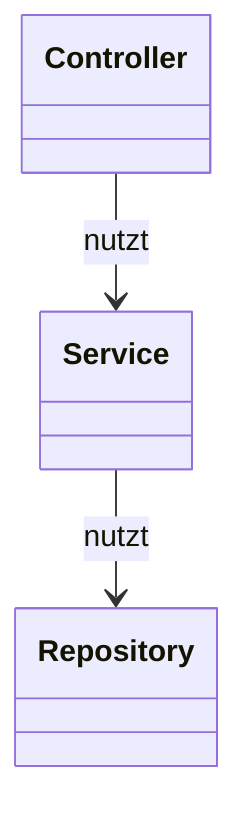
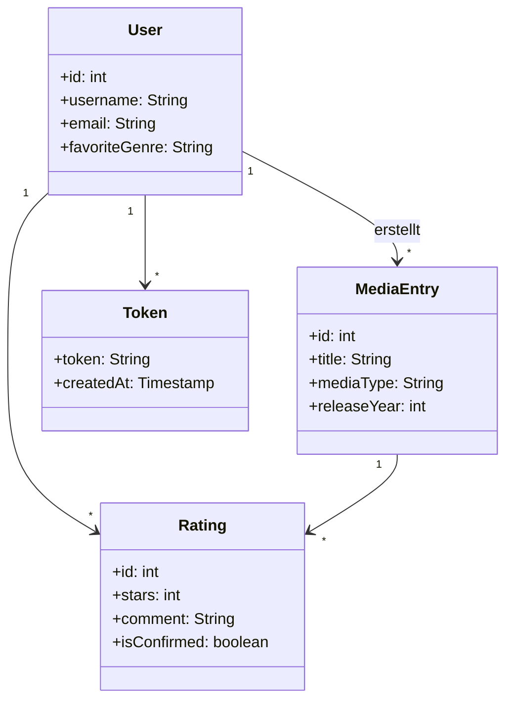

# AppDesign

## Ziel & Überblick
Diese App ist eine **Media Rating Platform** mit einem schlanken HTTP-Server auf Basis von `com.sun.net.httpserver.HttpServer`. Die Anwendung bietet JSON-Endpunkte für Registrierung/Login, Medienverwaltung, Bewertungen, Kommentare, Favoriten, Likes, Empfehlungen, Leaderboard und Profilstatistiken. Sie folgt einer klaren Schichtung (Controller → Service → Repository) und nutzt PostgreSQL als persistente Datenbank.

## Architekturentscheidungen

### 1) Plain Java `HttpServer` statt Framework
**Entscheidung:** Einsatz des eingebauten Java-HTTP-Servers als Router mit Middleware.

**Begründung:**
- Minimale Abhängigkeiten, schnelle Startzeit, leichter zu verstehen.
- Geeignet für Lern- oder Prototyping-Kontexte.

**Vorteile:**
- Geringer Overhead, keine komplexe Framework-Konfiguration.
- Feingranulare Kontrolle über Routing und Middleware.

**Nachteile:**
- Weniger Komfort (kein automatisches Routing, kein DI, weniger Middleware-Ökosystem).
- Mehr Boilerplate-Code für JSON-Parsing, Fehlerhandling, Validierung.

**Alternativen:**
- **Spring Boot/Javalin/Spark:** Schnellere Entwicklung, Ökosystem für Security/JSON/DI. Nachteil: schwergewichtiger, mehr Konventionen.

---

### 2) Schichtenarchitektur (Controller → Service → Repository)
**Entscheidung:** Klare Trennung der Verantwortlichkeiten.

**Begründung:**
- Fördert Wartbarkeit, Testbarkeit und Erweiterbarkeit.
- Services kapseln Geschäftslogik, Repositories den Datenzugriff.

**Vorteile:**
- Logik bleibt unabhängig von HTTP/DB-Details.
- Unit-Tests können Services isoliert prüfen.

**Nachteile:**
- Mehr Klassen/Dateien, initialer Strukturaufwand.

**Alternativen:**
- **Anemische Controller (Alles im Controller):** Schnell, aber schwer testbar/wartbar.
- **Domain-Driven Design (DDD):** Sehr mächtig, aber hoher Modellierungsaufwand.

---

### 3) PostgreSQL als persistente Datenbank
**Entscheidung:** Speicherung der Domänenobjekte (User, Media, Ratings, etc.) in PostgreSQL.

**Begründung:**
- Starke Konsistenz, relationale Integrität, Transaktionen.
- SQL eignet sich für aggregierte Abfragen (Durchschnittsratings, Leaderboard).

**Vorteile:**
- ACID-Garantien, Indizes, Constraints.
- Einfache Datenanalyse/Reporting.

**Nachteile:**
- Schema-Migrationen nötig, komplexer als In-Memory.

**Alternativen:**
- **In-Memory:** Schnell, aber volatil, nicht persistent.
- **NoSQL (z. B. MongoDB):** Flexibles Schema, aber komplexere Joins und Konsistenz.

---

### 4) JWT-Authentifizierung + Token-Store in DB
**Entscheidung:** JWT zur Authentifizierung; zusätzlich Speicherung der Tokens in der Tabelle `tokens`.

**Begründung:**
- JWT ermöglicht stateless Auth auf HTTP-Ebene.
- DB-Storage erlaubt Server-seitige Kontrolle über aktive Tokens.

**Vorteile:**
- **Token-Revoke/Logout** möglich (Token lässt sich serverseitig invalidieren).
- **Auditing**: Überblick über aktive Sessions.
- **Sicherheit**: gestohlene Tokens können gezielt gesperrt werden.

**Nachteile:**
- Teilweise Verlust des „stateless“-Vorteils; DB-Lookups pro Request.
- Zusätzlicher Storage- und Indexaufwand.

**Alternativen:**
- **Rein stateless JWT:** Keine DB-Lookups; Nachteil: Token kann bis Ablauf nicht invalidiert werden.
- **Refresh-Token + Access-Token:** Access-Token kurzlebig, Refresh-Token in DB; bessere Security, aber mehr Komplexität.
- **Session-Cookies (serverseitig):** Klassische Sessions; einfacher Logout, aber weniger skalierbar bei verteilten Instanzen ohne Session-Store.
- **Cache (z. B. Redis) für Token-Blacklist:** Schneller als DB, aber zusätzlicher Infrastruktur-Stack.

---

### 5) Geschäftsregeln in Services (z. B. eindeutige Bewertung)
**Entscheidung:** Regeln wie „eine Bewertung pro User/Media“ und „Bestätigung für Kommentare“ liegen in Services und werden durch DB-Constraints unterstützt (Unique-Key).

**Begründung:**
- Zentralisiert die Logik und schützt vor inkonsistentem Verhalten.
- Datenbank-Constraint ist zweite Verteidigungslinie.

**Vorteile:**
- Konsistenz auch bei parallelen Requests.
- Klarer Ort für Regeln, die Business-Logik definieren.

**Nachteile:**
- Zusätzliche Fehlerfälle (Constraint-Fehler) müssen gehandhabt werden.

**Alternativen:**
- Logik nur im Controller: schneller, aber fehleranfälliger.
- Logik nur in DB: weniger flexibel in Anwendungscode.

---

### 6) Prepared Statements für Datenzugriff
**Entscheidung:** Datenbankzugriffe werden über Prepared Statements ausgeführt.

**Begründung:**
- Schutz vor SQL-Injection und bessere Performance bei wiederholten Queries.

**Vorteile:**
- Sicherheit, Wiederverwendbarkeit.
- Klar definierte Parameterübergabe.

**Nachteile:**
- Mehr Boilerplate als ORM.

**Alternativen:**
- **ORM (JPA/Hibernate):** Höhere Produktivität, aber versteckte SQL-Komplexität.

---

## Datenmodell (Auszug)
- `users`: Registrierung, Profilstatistiken
- `media_entries`: Medienobjekte
- `ratings`: Bewertungen, Kommentarbestätigung, Aktivitätszähler
- `rating_likes`, `favorites`: Nutzerinteraktionen
- `tokens`: JWT Token-Tracking


## Struktur (High-Level)
```
app/
  controller/    HTTP-Endpunkte
  service/       Geschäftslogik & Regeln
  repository/    Datenzugriff (SQL)
  middleware/    JWT-Validierung
  model/         Domain-Objekte (User, Media, Rating, ...)
```

## Klassendiagramme

### 1) Schichtenmodell


### 2) Domänenmodell (vereinfacht)


## Qualität & Testbarkeit
- Services sind isoliert testbar (JUnit-Tests vorhanden, benötigen PostgreSQL).
- DB-Constraints unterstützen die Geschäftsregeln.
- Middleware validiert Tokens und schützt Endpunkte.